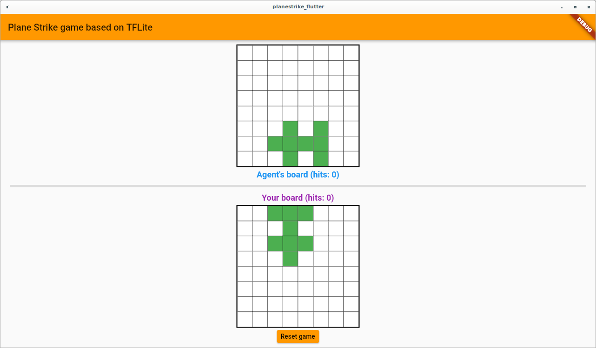

# Plane Strike: a game built with JAX, TFLite and Flutter. 
### **\*This is a personal project and is in no way an official product of the company I work for\***

Plane Strike is a small game that can be played on both Android/iOS/desktop(web support will be added when [tflite_flutter_plugin](https://github.com/am15h/tflite_flutter_plugin) supports web).

### Overview

The game rule for Plane Strike is very simple. It is a turn-based board game and is very similar to the [Battleship game](https://en.wikipedia.org/wiki/Battleship_(game)). The only difference is that Battleship allows you to place battleships (2–5 cells in a row or a column as battleships); you can place multple ships. Plane Strike instead allows you place a ‘plane’ on the board at the beginning of the game. So below we can see 2 boards (the top one is the agent's board and the bottom one is yours), each of which has a plane on the board. Of course you have no visibility on the agent’s plane location. So in a real game, the agent’s plane is hidden; you need to guess out all the plane cells before the agent does to your plane cells. The one who finds out all the plane cells first wins. Then the game restarts.

At the beginning of the game, the app will randomly place the planes for the agent and the player. You can see the plane as 8 green cells in your board. If you are not happy with the placement, just reset the game so that the plane placement will be changed. I'm too lazy to implement the UI flow to allow users to manually place the plane. 

During the game play, if you, as the player, strike at a cell in the agent's board at the top, and if it turns out that that cell is a 'plane cell', that cell will turn red (think of this action as a hit); if it's not a 'plane cell', the cell will turn yellow as a miss. The app also tracks the number of hits of both boards so that you can a quick idea of the game progress.

### How it's built

Under the hood, the agent is trained with [Flax](https://github.com/google/flax) (a high-level neural network library for [JAX](https://github.com/google/jax/)) using policy gradient reinforcement learning (REINFOCE). Training code is in training/planestrike.py. JAX has experimental support for converting JAX/Flax models to TensorFlow models. In our case, we convert the Flax module to a TF concrete function and then convert it to a TFLite model.

The frontend is built with Flutter, which comes with cross-platform support for free. The model is actually pretty simple, so there is really no need to run inference on it on server side. On-device ML is more than sufficient. Since TFLite does not have an official interface for Flutter, we are using this open source [tflite_flutter_plugin](https://github.com/am15h/tflite_flutter_plugin) project to run inference.

Refer to [Medium Blog](https://windmaple.medium.com/playing-a-board-game-on-device-using-tensorflow-lite-and-fluter-a7c865b9aefc) ([Chinese version](https://mp.weixin.qq.com/s/ZpY2qJ-P4NUmmk_WAUs93w)) for more technical details.

